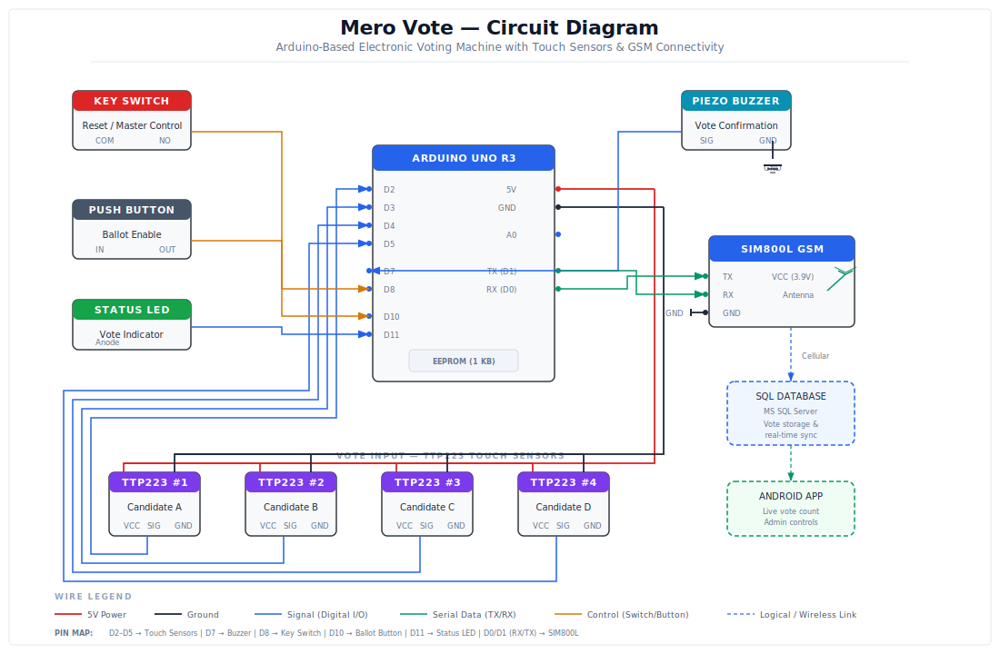

# Mero Vote — IoT-Based Electronic Voting Machine

> A complete IoT electronic voting system built with Arduino, TTP223 touch sensors, SIM800L GSM module, MS SQL Server, and an Android companion app for real-time vote tallying.



---

## Overview

**Mero Vote** is a semi-automatic electronic voting system designed as an alternative to traditional paper-based voting in Nepal. The system replaces manual ballot marking and counting with a hardware-software solution that captures votes via capacitive touch sensors, stores them securely in a SQL database over cellular network, and displays live results through an Android application.

This project was developed as a **B.E. Minor Project** at the Department of Computer Engineering, Pokhara Engineering College (Pokhara University), in 2022.

### Problem

Traditional paper ballot systems suffer from high rates of invalid votes (improper marking), slow manual tallying, significant printing and labor costs, and vulnerability to human error during counting.

### Solution

Mero Vote addresses these issues with a three-part architecture:

| Component | Description |
|-----------|-------------|
| **EVM (Electronic Voting Machine)** | Arduino Uno with TTP223 touch sensors for vote input |
| **Database Server** | MS SQL Server for persistent, secure vote storage |
| **Android App** | Real-time vote count display and admin election controls |

---

## System Architecture

```
┌─────────────────────┐       Cellular (GSM)       ┌──────────────────┐
│   VOTING MACHINE    │ ──────────────────────────► │   SQL DATABASE   │
│                     │    SIM800L GSM Module       │  MS SQL Server   │
│  Arduino Uno R3     │                             └────────┬─────────┘
│  TTP223 x4 Sensors  │                                      │
│  Key Switch (Reset) │                                      │  SQL Query
│  Ballot Button      │                                      ▼
│  Piezo Buzzer       │                             ┌──────────────────┐
│  Status LED         │                             │   ANDROID APP    │
│  EEPROM Backup      │                             │  Live Vote Count │
└─────────────────────┘                             │  Admin Controls  │
                                                    │  Election Reset  │
                                                    └──────────────────┘
```

---

## Hardware Components

| Component | Model | Purpose |
|-----------|-------|---------|
| Microcontroller | Arduino Uno R3 | Central controller, vote processing, EEPROM storage |
| Touch Sensors | TTP223 × 4 | Capacitive touch input — one per candidate |
| GSM Module | SIM800L | Transmit vote data to SQL database over cellular |
| Key Switch | 2-position | Master reset / election officer control |
| Push Button | Momentary | Ballot enable — authorizes a single vote session |
| Buzzer | Piezo | Audio confirmation on successful vote |
| LED | Green | Visual vote confirmation indicator |
| Power | 5V (Arduino), 3.9V 2A (SIM800L) | Separate regulated supplies |

### Pin Mapping

| Arduino Pin | Connected To |
|-------------|-------------|
| D2 | TTP223 Sensor #1 (Candidate A) |
| D3 | TTP223 Sensor #2 (Candidate B) |
| D4 | TTP223 Sensor #3 (Candidate C) |
| D5 | TTP223 Sensor #4 (Candidate D) |
| D7 | Piezo Buzzer |
| D8 | Key Switch (Reset) |
| D10 | Ballot Push Button |
| D11 | Status LED |
| D0 (RX) | SIM800L TX |
| D1 (TX) | SIM800L RX |

---

## Software Stack

| Layer | Technology |
|-------|-----------|
| Firmware | C/C++ (Arduino IDE) |
| Database | Microsoft SQL Server Management Studio |
| Android App | Java (Android Studio) |
| Communication | Serial (Arduino ↔ SIM800L), Cellular (GSM ↔ SQL Server) |

---

## How It Works

### Voting Flow

1. **Election officer** turns the key switch to enable the system.
2. **Officer presses** the ballot button to authorize one vote session.
3. **Voter touches** one of the four TTP223 sensors to cast their vote.
4. **Arduino** registers the touch, increments the count in EEPROM, triggers the buzzer and LED for confirmation.
5. **SIM800L** transmits the updated vote data to the SQL database over cellular network.
6. **System locks** until the officer authorizes the next voter with the ballot button.

### Admin Flow

1. Admin logs into the Android app with credentials.
2. App queries the SQL database and displays **live vote counts** per candidate.
3. Admin can **refresh** results or **reset** the database for a new election.

---

## App Screenshots

<p align="center">
  
  &nbsp;&nbsp;
  
  &nbsp;&nbsp;
  
</p>

> **Note:** If screenshots are not yet in the repo, add them to a `screenshots/` directory.

---

## Getting Started

### Prerequisites

- Arduino IDE (1.8+)
- Android Studio (Arctic Fox or later)
- Microsoft SQL Server Management Studio
- SIM card with active data plan (for SIM800L)

### Hardware Setup

1. Wire components according to the [circuit diagram](#circuit-diagram) and pin mapping table above.
2. Ensure separate power supplies: **5V** for Arduino, **3.9V / 2A** for SIM800L.
3. Insert an active SIM card into the SIM800L module.

### Firmware Upload

```bash
# Open the Arduino sketch in Arduino IDE
# Select Board: Arduino Uno
# Select the correct COM port
# Upload the sketch
```

### Database Setup

1. Open SQL Server Management Studio.
2. Create a new database and the vote table:
   ```sql
   CREATE TABLE dbo.vote (
       sensor1 INT DEFAULT 0,
       sensor2 INT DEFAULT 0,
       sensor3 INT DEFAULT 0,
       sensor4 INT DEFAULT 0 -- extend for more candidates
   );
   ```
3. Configure the server to accept remote connections from the GSM module.

### Android App

1. Open the Android project in Android Studio.
2. Update the SQL Server connection string in the source code with your server's IP and credentials.
3. Build and install on an Android device or emulator.

---

## Circuit Diagram

The full circuit diagram is included in this repository as an SVG file:

**[`mero_vote_circuit_diagram.svg`](./mero_vote_circuit_diagram.svg)**

---

## Project Structure

```
MeroVote/
├── arduino/                  # Arduino firmware (C/C++)
│   └── mero_vote.ino
├── android/                  # Android Studio project
│   └── app/
│       └── src/
├── database/                 # SQL scripts
│   └── schema.sql
├── screenshots/              # App screenshots
├── mero_vote_circuit_diagram.svg
├── LICENSE
└── README.md
```

> Adjust the structure above to match your actual repository layout.

---

## Testing

| # | Test Case | Result |
|---|-----------|--------|
| 1 | Vote registered on touch sensor press | ✅ Passed |
| 2 | Data transmitted to SQL database | ✅ Passed |
| 3 | App executes SQL query correctly | ✅ Passed |
| 4 | Multiple votes by same voter invalidated | ✅ Passed |
| 5 | Reset function truncates database table | ✅ Passed |
| 6 | Login authentication works | ✅ Passed |
| 7 | EEPROM and server database store consistent data | ✅ Passed |

---

## Limitations

- Android only — no iOS support.
- Once reset is completed, vote data cannot be recovered locally.
- Reset requires clearing both EEPROM and database separately.
- Requires cellular network coverage at the polling station.

---
**Supervisor:** Er. Sandep Gupta

**Institution:** Department of Computer Engineering, Pokhara Engineering College, Pokhara University

---

## License

This project was developed for academic purposes as part of B.E. coursework at Pokhara University.

---

<p align="center">
  <sub>Built with Arduino, Java, SQL, and a lot of solder — Pokhara, 2022</sub>
</p>
